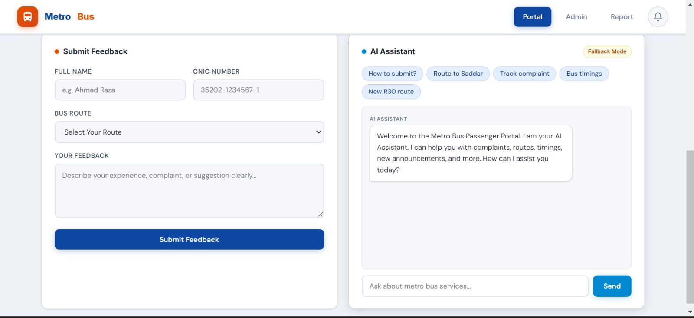
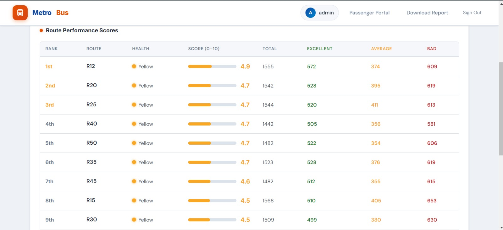

<h1 align="center">🚌 AI-Based Metrobus Feedback Analyzer System</h1>

<p align="center">
  <b>A modern, full-stack AI platform designed for the Punjab Mass Transit Authority to analyze passenger feedback, evaluate route performance, and process public complaints in real time using NLP and Machine Learning.</b>
</p>

<p align="center">
  &nbsp;
  &nbsp;
  &nbsp;
  
</p>

<p align="center">
  <i>A smart feedback portal and AI-driven admin analytics system for public transport service optimization.</i>
</p>

---

## 📸 Project Screenshots

### 🌐 Public Passenger Portal

| Main Portal Window | Feedback Submission & AI Assistant |
| :---: | :---: |
|  |  |

---

### 📊 Admin Dashboard & AI Analytics

| Analytics & Emotion Distribution | Route Performance Scores |
| :---: | :---: |
|  |  |

| Real-Time AI Analyzer |
| :---: |
|  |

---

## ✨ Key Features

* **Passenger Feedback Portal:** Clean and intuitive UI for commuters to submit complaints, suggestions, and compliments.
* **Interactive AI Assistant:** Built-in portal assistant to answer passenger queries regarding routes, timings, and complaint tracking.
* **Admin Analytics Dashboard:** Comprehensive view of total, pending, completed, and delayed complaints with interactive emotion distribution charts.
* **Route Performance Scoring:** Ranks bus routes based on passenger ratings, health metrics, and feedback status.
* **Real-time AI Sentiment Analyzer:** On-demand NLP analyzer to extract insights and emotion categories from any feedback text instantly.
* **Automated CSV & Report Generation:** Option to bulk upload CSV data and export summary PDF reports.

---

## 📁 Repository Structure

```text
├── __pycache__/          # Python bytecode cache
├── data/                 # Raw datasets and processed CSV feedback files
├── static/css/           # Stylesheets and custom CSS layouts
├── templates/            # HTML templates for passenger & admin interfaces
├── admin dashboard.jpeg  # Screenshot: Admin dashboard view
├── ai analyzer.jpeg      # Screenshot: AI Sentiment Analyzer tool
├── ai_analysis.py        # Core NLP logic for emotion & sentiment classification
├── app.py                # Main application routes & server configuration
├── csv_handler.py        # CSV parsing and bulk data upload handling
├── feedback.jpeg         # Screenshot: Passenger feedback form & AI chatbot
├── main window.jpeg      # Screenshot: Passenger portal landing page
├── ml_model.py           # Machine Learning model definition and inference
├── report_generator.py   # PDF report generation utility
├── requirements.txt      # Project dependencies and libraries
├── routes.jpeg           # Screenshot: Route performance ranking table
└── run.py                # Main script to execute the application
```
## 🛠️ Libraries & Technologies Used

* **Language:** Python 3.x
* **Web Framework:** Flask
* **Machine Learning & NLP:** Scikit-Learn, NLTK
* **Data Handling:** Pandas, NumPy
* **Frontend:** HTML5, CSS3, JavaScript

---

## 🚀 How to Run the Project

### Option 1: Direct Run (Easiest Method)
Simply **double-click** on the **`run.py`** file inside the project folder to start the application.

---

### Option 2: Running via Terminal / Command Prompt

1. **Clone the Repository:**
   ```bash
   git clone [https://github.com/your-username/Ai-Based-Metrobus-Feedback-Analyzer-System.git](https://github.com/your-username/Ai-Based-Metrobus-Feedback-Analyzer-System.git)
   cd Ai-Based-Metrobus-Feedback-Analyzer-System

Install Required Libraries:

```Bash


pip install -r requirements.txt
```
Start the Application:

```Bash


python run.py
```
After executing, open your web browser and navigate to:

http://127.0.0.1:5000/


